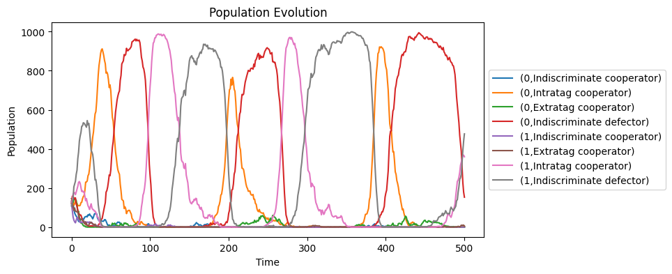
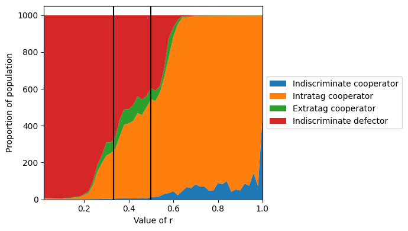

# False Green Beard Evolutionary Game

This is a simulation of how the ability to recognize members of the population with the same strategy as you can prevent the dominance of the defectors. This is base on the prisioner's dilemma, in which is always better to defect, and how we can prevent that simulating a tag recognition, which means that the population can recognize between the members of the population. This is not an original idea of mine, it is based on an existing paper.

The original simulation is describe in the paper: "Evil green beards: Tag recognition can also be used to withhold cooperation in structured population" created by Julián García, Matthijs van Veelen, Arne Traulsen.

**Special thanks to Matthijs van Veelen who had no problem explaining to me the details of their simulation so that I could replicate them.**

## Green Beard

The idea, extracted from the book The selfish gene of Richard Dawkins, is that if we could have a visible trait that show if we are cooperating with the rest of the population, like a green beard. Then the individuals with this trait could be altruistic only with the rest of the green beards and be more successfull than the rest of the population that is selfish.

Of course the natural problem of this idea is that they will appear individuals with the green beard, but that are selfish, because genetically it is not reasonable to expect other wise. This we call them false green beard

## Tags

In the simulation we impletended 2 tags. All individuals are categorized as being of the group of one of the tags. This means that the strategist can depend on if the other individual has the same tag as you or not.

## Familiarity

In the simulations we implement a familiarity factor we called r. This factor is the probability of finding another individual that has the same strategy as you. This is to simulate that you find someone that you are familiar with and that you know its strategy. If r is 1, this means that you will always encounter individuals of your same strategy.

